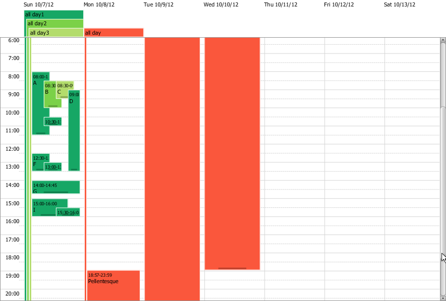
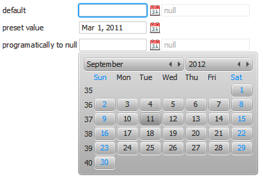
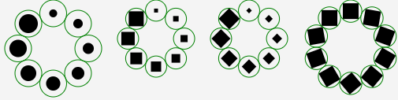
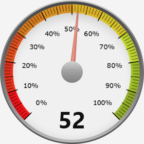

# JFXtras

A supporting library for JavaFX, containing helper classes, extended layouts, controls and other interesting widgets.

## Examples
JFXtras features an agenda control, mimicking Google Calendar with a few twists, 
like a "pole" on whole day appointments so they are visible through out the day.

Also a date and time picker, plus associated text fields.

Or a circular pane, aimed at those new round screen becoming more and more popular,
which can animate the nodes into position.

Which was used to create two menus:

Some dials, inspired by Gerrit Grunwald's work:

## Project structure:

    Root project 'jfxtras-parent'
    +--- Module 'jfxtras-agenda'
    +--- Module 'jfxtras-common'
    +--- Module 'jfxtras-controls'
    +--- Module 'jfxtras-font-roboto'
    +--- Module 'jfxtras-fxml'
    +--- Module 'jfxtras-gauge-linear'
    +--- Module 'jfxtras-icalendaragenda'
    +--- Module 'jfxtras-icalendarfx'
    +--- Module 'jfxtras-menu'
    +--- Module 'jfxtras-test-support'
    \--- Module 'jfxtras-window'

## How to use

The easiest way to use JFXtras is by using Maven or Gradle and access the [Maven central repository](https://search.maven.org/search?q=g:org.jfxtras).

The `group-id` is `org.jfxtras`, the `artifact-id` is the module name.

###### Maven:

    <dependency>
      <groupId>org.jfxtras</groupId>
      <artifactId>jfxtras-controls</artifactId>
      <version>11-r1-SNAPSHOT</version>
    </dependency>
    
###### Gradle:

    compile group: 'org.jfxtras', name: 'jfxtras-controls', version: '11-r1-SNAPSHOT'

## License

JFXtras uses the [new BSD](http://en.wikipedia.org/wiki/BSD_licenses#3-clause_license_.28.22Revised_BSD_License.22.2C_.22New_BSD_License.22.2C_or_.22Modified_BSD_License.22.29) license
